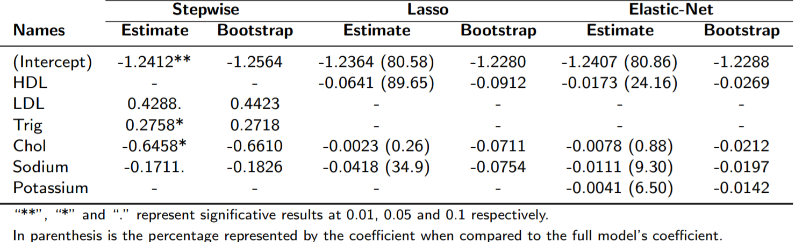
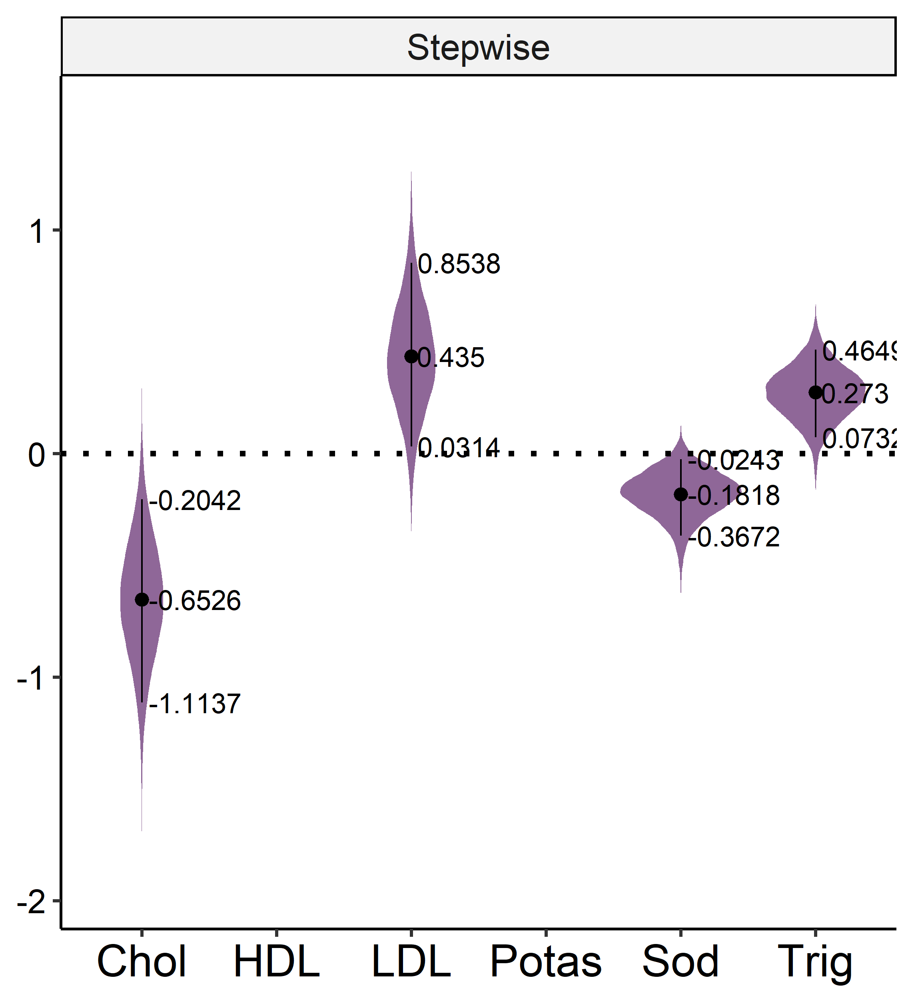
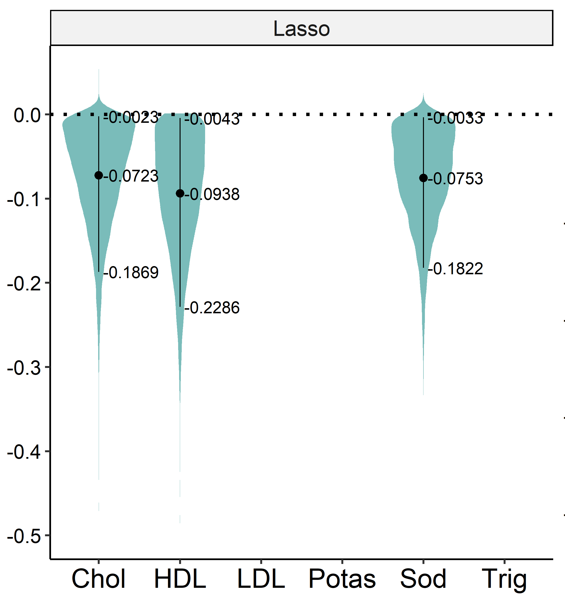
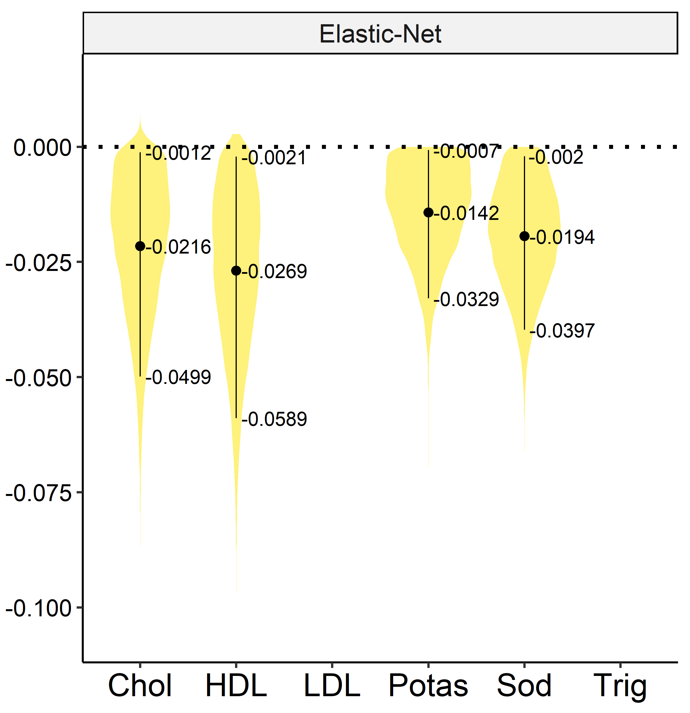
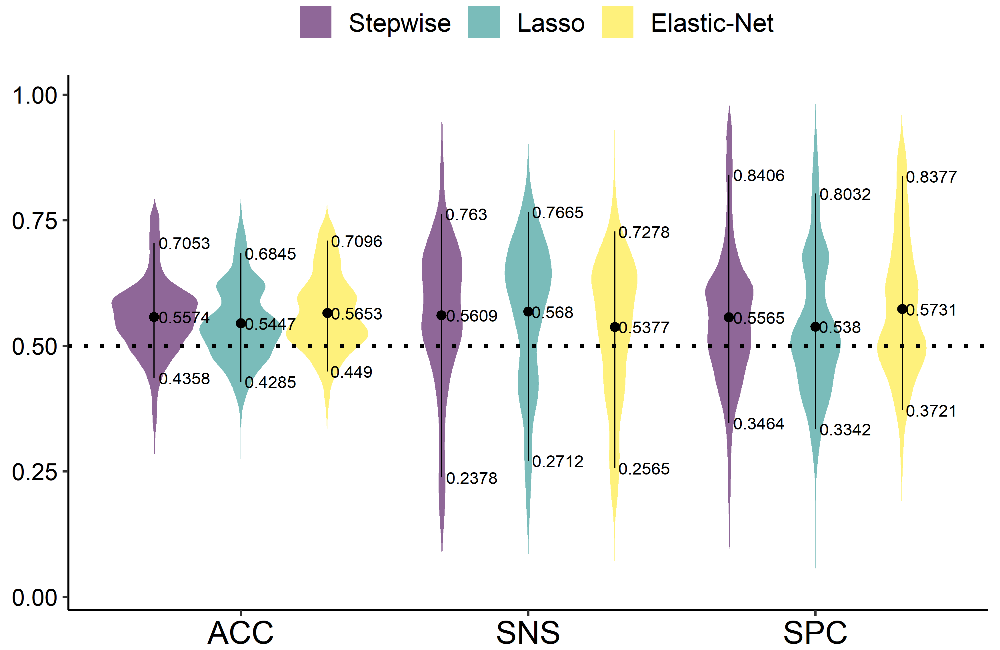

class: inverse, center, middle

```{r xaringan-themer, include = FALSE}
library(xaringanthemer)
write_xaringan_theme(title_slide_background_color = "white",
                     title_slide_background_image = "images/Logo2.png", 
                     title_slide_background_size = "100% 100%", 
                     title_slide_background_position = "0% 0%", 
                     title_slide_text_color = "black", 
                     inverse_background_color = "#2c5b91", 
                     link_color = "#6dcbdc", 
                     header_color = "#2c5b91", 
                     text_bold_color = "#2c5b91", 
                     text_font_family = "Yanone Kaffeesatz", 
                     text_font_size = "28px")

extra_css <- list(
  ".title-slide h2" = list(color= "#9292c7"),
  ".page-font" = list("font-size" = "22px")
)
write_extra_css(extra_css)
```

```{r, include=FALSE}
# Loading the results in order to not need to run them all again
library(tidyverse)
library(kableExtra)
load("models_and_bootstraps.RDS")
```


# Chronic Fatigue Syndrome

## Definition and factors

---
background-image: url(images/cfs1.png)
background-position: 0% 100%
background-size: 200px 200px

# Chronic Fatigue Syndrome (CFS)

According to the World Health Organization (WHO/OMS):
  >...serious, long-term illness that affects many body systems. People with it are often not able to do their usual activities and, at times, may be confined to bed.


In medical practices since 1988, it's also called **Myalgic encephalomyelitis** (ME).

--- 

First defined by the USA Center for Disease Control  (Holmes et al., 1988).

The revision of Fukuda et al. (1994) is most frequently used.

---
background-image: url(images/cfs2.jpg)
background-position: 95% 50%
background-size: 300px 200px

## Fukuda's case definition

A case of Chronic Fatigue Syndrome has:

- **Persistent or relapsing fatigue for 6 or more months**.

- With at least 4 out of:
  
  - Sore throat;
  - Muscle pain;
  - Joint pain;
  - Headaches;
  - Tender lymph nodes;
  - Unrefreshing sleep;
  - Memory or concentration impairment;
  - Post-extertional malaise*****.

.footnote[[*****] Criticized by not demanding this important symptom (Williams et al., 2014)].


---

# Importance of CFS

It's a relatively common disorder:

- 410 cases per 100.000 Americans (Jason et al., 1999);
  - Estimate of 1 million cases in EUA alone;


- 850.000 Americans according to Jason e Njoku (2006).

- 857/100.000 estimating 2.8 million Americans (Valdez et al., 2019).

--
background-image: url(images/exclamation.png)
background-position: 75% 90%
background-size: 90px 150px

--- 

CFS affects children's life quality **as much as Asthma and Type I Diabetes Mellitus** (Kennedy et al., 2010).

Therefore, interferes in the individual's:

  - Health condition;
  - Social and professional lives.

---
class: inverse, center, middle

# CFS factors

## The ongoing research

---
background-image: url(images/research.png)
background-position: 95% 90%
background-size: 150px 150px

# CFS factors

The definition of the CFS factors is an ongoing effort.

The ones with most evidence are:

- Irregular sleep (Samaha et al., 2007);

- Psychological stress (Servaes et al., 2002; Nagy-Szakal et al., 2018);

- Nutrient deficiency (Naviaux et al., 2018);

- Cholesterol abnormalities (Bjørklund et al., 2019);

- Hormonal and Immunological dysfunctions (Sotzny et al., 2018);

- Infections (Litleskare et al., 2018).
 
---

# Other conditions

There is also evidence of relation with other conditions:

- **Neurally-mediated hypotension** (Bou-Holaigah et al., 1995).
  
  - Sodium-based treatment reduced the severity in some individuals.
<br><br>
- **Metabolic Syndrome** (Maloney et al., 2010).

  - Includes high levels of glucose and abnormal cholesterol.
<br><br>
- Elevated risk after 10 years of **Giardia infection** (Litleskare et al., 2018).
  
  - Ratio of 2.22 to 4.08 as compared to control cases.

---
class: inverse, center, middle

# Prevention of CFS

## Statistical modelling as a path

---
background-image: url(images/predict.png)
background-position: 85% 5%
background-size: 120px 120px

# CFS Prevention

Given the ongoing search for factors, statistical models are progressing on the prevention:
<br><br>

- **Nayve Bayes** obtained **AUC of 0.70** on gene expression data (Huang et al., 2007).
<br><br><br>
- Servaes et al. (2002) studied CFS in breast-cancer individuals with **linear models**.
  - Found evidence of physical, psychologic and cognitive factors.
<br><br><br>
- By **decision trees** on medical survey data, Bronikowski et al. (2011) obtained **accuracy of 71.88%**.


---
class: inverse, center, middle

# Our contribution

## Relations between absenteeism and CFS?

---
background-image: url(images/truck.svg)
background-position: 95% 90%
background-size: 150px 150px

# The data we had

Cross-sectional study on 621 off-road truck drivers in a **mine**.
  
The individuals worked on **alternated shifts**: 6hrs shifts and 12hrs of rest.

From the project: **Síndrome Metabólica em Trabalhadores de Mineração em MG**.

--- 

The measured variables were:

 - **Absenteeism**: Was there any ocurrence in the year?
 
 - 11 biochemical;
 
 - 8 anthropometric;
 
 - 2 socio-demographic.

---

|       Variable        |           Source        |       Type      |   Average   |   St.Dev.  |  % Miss  |
|:---------------------:|:-----------------------:|:---------------:|------------:|-----------:|---------:|
|         Skipped       |     Company regiter     | Binary (Y = 1) |    0.2238   |     -      |   0.00   |
|          Sex          |      Medical files      | Binary (M = 1) |    0.9646   |     -      |   0.00   |
|         Age           |      Medical files      |   Discrete     |   36.7504   |   7.1336   |   0.00   |
|          BMI          |       Weight/Height²    |   Continuous   |  174.1032   |   7.3123   |   5.25   |
| Waist/Hips Ratio (n=3)|       Metric tape       |  Continuous    |    0.8566   |   0.1220   |   2.64   |
|  Total Body Fat       |       Bioimpedance      |  Continuous    |   24.3923   |   8.1730   |   3.50   |
|    Visceral Fat       |       Bioimpedance      |  Continuous    |    7.6712   |   3.4312   |   3.33   |
|   Diast. Press. (n=3) |   Semi-autom. Monitor   |  Continuous    |   82.7661   |   9.3659   |   0.16   |
|    Sist. Press. (n=3) |   Semi-autom. Monitor   |  Continuous    |  131.5532   |  13.7510   |   0.16   |
|     HDL Cholesterol   |   Colorimetric Enzyme   |  Continuous    |   55.4063   |  16.3538   |   5.79   |
|      Triglycerides    |   Colorimetric Enzyme   |  Continuous    |  151.5527   |  83.6749   |   5.61   |
|    Total Cholesterol  |   Colorimetric Enzyme   |  Continuous    |  194.5765   |  45.4948   |   5.61   |
|        Calcium        | Ion-selective electrode |  Continuous    |    9.5704   |   1.2965   |   5.61   |
|       Phosphorus      |     Kinetic UV Test     |  Continuous    |    3.5085   |   0.5965   |  **42.43** |
|       Vitamin D       |    Chemiluminescence    |  Continuous    |   25.4991   |   7.7247   |  **38.62** |
|      PTH Hormone      |    Chemiluminescence    |  Continuous    |   30.8635   |  10.8913   |  **25.96** |
|        Glucose        |   Colorimetric Enzyme   |  Continuous    |   86.9475   |  14.5506   |   5.08   |
|         Sodium        | Ion-selective electrode |  Continuous    |  144.2196   |   8.1133   |  12.70   |
|        Potassium      | Ion-selective electrode |  Continuous    |    4.7249   |   0.7105   |   9.72   |

<style>
td {
  font-size: 20px
}
</style>

---
background-image: url(images/shift.png)
background-position: 85% 5%
background-size: 120px 120px

# CFS and shifts

Shift work systems disrupt circadian cycles, leading to **shift-lag**:

- Fatigue, sleepiness and insomnia;

- Irritability;

- Impairment of mental agility;

according to Costa (2010), all factors of CFS.

**Shift frequency** is positively correlated with **CFS severity** (Shen et al., 2005).

---
background-image: url(images/mining.png)
background-position: 85% 5%
background-size: 120px 120px

# CFS and shifts on mines

The mining industry is characterized by:

- Risky work conditions;
	
- High psychological stress;

which, together with shift work, increases the risk of CFS.
<br><br>

CFS increases the risk of fatal accidents in risky environments.
<br><br>

Fatigue is positively correlated with perilous driving (Useche et al., 2017).

---
background-image: url(images/absent.png)
background-position: 85% 65%
background-size: 160px 160px

# CFS and absenteeism

According to Colquhoun e Senn (2000), shift workers constantly complain of:

- Irritability;

- Anxiety;

- Stressful work conditions.

--- 

Shift work on mines may lead not only to CFS but also:

  - Neuroticism;
  
  - Chronic anxiety/Depression;
  
resulting in **higher risk of absenteeism and need for psychotropic drugs** (Nakata et al (2004).

---
class: inverse, center, middle

# The approach

## Statistical methodology and Software

---

## Objectives

In this context, we aimed to:

- Study the relation of the variables with absenteeism;

- Search for similar relations in the literature for CFS.

--

## Pre-processing

Removal of variables with more than 15% missing.

Imputation of missing data with missForest (Random Forests Imputation):
  - Prediction of missing values with **Random Forests**;
  
  - Outperformed KNN, bPCA and MICE in simulations (Waljee et al., 2013) 

The remaining variables were then **standardized**.


---

# Logistic regression

The Logistic model was used with 3 approaches:

  - **Stepwise**: variable selection;
  
  - **Elastic-Net** and **Lasso**: variable selection and regularization.
  
--- 

The Elastic-Net penalizes the Resiadual Sum of Squares (RSS):

$$RSS + \lambda(\frac{1-\alpha}{2}\sum\hat{\beta_j^2} + \alpha\sum|\hat{\beta_j}|)$$

shrinking $\hat{\beta}$ according to $\lambda$ and $\alpha$. When $\alpha = 1$ it becomes the Lasso.

According to Pavlou et al. (2015), it reduces bias introduced when the Events Per Variable (EPV) are less than 10. **Our EPV is 8.69**. 

---

# Model selection

Both Stepwise and Elastic-Net need to select the best models:

  - Stepwise: Find the best subset of variables at each iteration;
  
  - Elastic-Net: Find $\lambda$ and $\alpha$ for the best model performance.

<br>
**Cross Validation 10-fold** was used with:

  - **Stratification**: Garanteeing class balance in all folds.
  
  - **10 repetitions**: Reducing variability due to fold randomization;

<br>
The used metric was the **Area Under the ROC curve (AUC)**: Values close to 1 indicate better class discrimination, as opposed to values close to 0.5.

---

## Variability assessment: 90% Confidence Intervals

For the coefficients, the **classical Bootstrap**:
  - Resample $n$ observations with replacement and fit the model.
  
  - Repeat $B$ times to obtain the empirical distribution of coefficients.
  
--- 

The metrics of **Accuracy**, **Sensitivity** and **Specificity** were assessed by the **Bootstrap 632** (Efron and Tibshirani, 1997):

  - Perform classical bootstrap and obtain performance $P_{train}$;
  
  - Obtain $P_{test}$ from the unsampled observations.
  
  - Combine them $P_{632} = 0.632 \times P_{train} + 0.368 \times P_{test}$.
  
---
background-image: url(images/rstudio.png)
background-position: 75% 50%
background-size: 200px 200px

## Software and packages

The analysis was made in the **R Language** (v3.5.1) using the RStudio IDE (v1.3.125).

<br>
The mainly used packages were:

  - `caret`: Model fitting and selection;
  
  - `ggplot2`: For visualizations;
  
  - `missForest`: Missing data imputation;
  
  - `tibble`, `tidyr` and `dplyr`: Data manipulation and cleaning;
  
  - `purrr` and `furrr`: Easily iterate and parallel processing.

---
class: inverse, center, middle

# Results

---

# Variable effects

```{r, echo=FALSE, out.height=250, out.width=1000, fig.align='center', warning=FALSE}

```

<br>
- Cholesterol and Sodium were significative in all three models.

- Models either included Triglycerides and HDL or LDL.

- Only Elastic-Net identified Potassium as a factor.
---

## Variable effects

```{r, echo=FALSE, out.height=470, out.width=600, fig.align='center', warning=FALSE, dpi=300}
#
plot_boot <- mutate(bootStepImp, Model = "Stepwise") %>% 
  bind_rows(mutate(bootLassoImp, Model = "Lasso")) %>% 
  bind_rows(mutate(bootElnetImp, Model = "Elastic-Net")) %>% 
  mutate(Method = ifelse(Model == "Stepwise", "Least Squares", "Regularized Least Squares"),
         Model = factor(Model, levels = c("Stepwise", "Lasso", "Elastic-Net"))) %>% 
  select(-cutoff, -AUC, -ACC, -SNS, -SPC) %>% 
  gather(-Model,-Method, key = "Coefficient", value = "Estimate")

plot_boot_ci <- plot_boot %>% 
  filter(Coefficient != "(Intercept)") %>% 
  group_by(Coefficient, Model, Method) %>% 
  summarise(LInf = quantile(Estimate, 0.05, na.rm = T),
            LSup = quantile(Estimate, 0.95, na.rm = T),
            Estimate = mean(Estimate, na.rm = T))

plot_boot$Estimate <- plot_boot$Estimate %>% replace_na(0)

options(scipen = 1000)
plot_boot %>% 
  filter(Coefficient != "(Intercept)", Model == "Stepwise") %>% 
  ggplot(aes(x = Coefficient, y = Estimate)) + 
  geom_violin(fill = "#440154", color = FALSE, alpha = 0.5) + 
  geom_pointrange(aes(x = Coefficient, y = Estimate, ymin = LInf, ymax = LSup, group = Model), 
                  position = position_dodge(width = 0.91), size = 0.9,
                  data = plot_boot_ci %>% filter(Model == "Stepwise")) +
  geom_text(aes(x = Coefficient, y = Val, label = round(Val, 4), group = Coefficient, hjust = -0.075), size = 6, 
            data = plot_boot_ci %>% filter(Model == "Stepwise") %>% 
              gather(-Coefficient, -Model, -Method, key = "Pos", value = "Val")) + 
  geom_hline(yintercept = 0, linetype = 3, size = 1) + 
  labs(x = NULL, y = NULL) +
  facet_wrap(~Model, scales = "free") + guides(fill = FALSE) +
  scale_fill_viridis_d() + scale_color_viridis_d() + 
  scale_x_discrete(labels = c("Chol", "HDL", "LDL", "Potas", "Sod", "Trig")) +
  theme(panel.grid.major.x = element_line(color = "black")) + 
  ggpubr::theme_pubr() + theme(text = element_text(size = 21), 
                               axis.text.y = element_text(size = 18))
```

All variables had significative effects.
---

## Variable effects

```{r, echo=FALSE, out.height=470, out.width=600, fig.align='center', warning=FALSE, dpi=300}
#
plot_boot %>% 
  filter(Coefficient != "(Intercept)", Model == "Lasso") %>% 
  ggplot(aes(x = Coefficient, y = Estimate)) + 
  geom_violin(fill = "#21908c", color = FALSE, alpha = 0.4) + 
  geom_pointrange(aes(x = Coefficient, y = Estimate, ymin = LInf, ymax = LSup, group = Model), 
                  position = position_dodge(width = 0.91), size = 0.9,
                  data = plot_boot_ci %>% filter(Model == "Lasso")) +
  geom_text(aes(x = Coefficient, y = Val, label = round(Val, 4), group = Coefficient, hjust = -0.075), size = 6, 
            data = plot_boot_ci %>% filter(Model == "Lasso") %>% 
              gather(-Coefficient, -Model, -Method, key = "Pos", value = "Val")) + 
  geom_hline(yintercept = 0, linetype = 3, size = 1) + 
  labs(x = NULL, y = NULL) +
  facet_wrap(~Model, scales = "free") + guides(fill = FALSE) +
  scale_fill_viridis_d() + scale_color_viridis_d() + 
  scale_x_discrete(labels = c("Chol", "HDL", "LDL", "Potas", "Sod", "Trig")) +
  theme(panel.grid.major.x = element_line(color = "black")) + 
  ggpubr::theme_pubr() + theme(text = element_text(size = 21), 
                               axis.text.y = element_text(size = 18))
```

Bias towards zero inherent to Elastic-Net is evident. Variables also significative.

---

## Variable effects

```{r, echo=FALSE, out.height=470, out.width=600, fig.align='center', warning=FALSE, dpi=300}
#
plot_boot %>% 
  filter(Coefficient != "(Intercept)", Model == "Elastic-Net") %>% 
  ggplot(aes(x = Coefficient, y = Estimate)) + 
  geom_violin(fill = "#fde725", color = FALSE, alpha = 0.4) + 
  geom_pointrange(aes(x = Coefficient, y = Estimate, ymin = LInf, ymax = LSup, group = Model), 
                  position = position_dodge(width = 0.91), size = 0.9,
                  data = plot_boot_ci %>% filter(Model == "Elastic-Net")) +
  geom_text(aes(x = Coefficient, y = Val, label = round(Val, 4), group = Coefficient, hjust = -0.075), size = 6, 
            data = plot_boot_ci %>% filter(Model == "Elastic-Net") %>% 
              gather(-Coefficient, -Model, -Method, key = "Pos", value = "Val")) + 
  geom_hline(yintercept = 0, linetype = 3, size = 1) + 
  labs(x = NULL, y = NULL) +
  facet_wrap(~Model, scales = "free") + guides(fill = FALSE) +
  scale_fill_viridis_d() + scale_color_viridis_d() + 
  scale_x_discrete(labels = c("Chol", "HDL", "LDL", "Potas", "Sod", "Trig")) +
  theme(panel.grid.major.x = element_line(color = "black")) + 
  ggpubr::theme_pubr() + theme(text = element_text(size = 21), 
                               axis.text.y = element_text(size = 18))
```

All variables also significative, including Potassium.
---

# Variable effects

The literature shows similar effects for CFS and Absenteeism:

  - Positively correlated with the risk:
  
    - **Trigycerides**: De Lorenzo et al. (1998)
    
    - **LDL Cholesterol**: Tomic et al. (2012);

  - Negatively correlated with the risk:
  
    - **Sodium**: Rowe and Calkins (1998); Comhaire (2015);
    
    - **Total Cholesterol**: Tomic et al. (2012);
    
    - **HDL Cholesterol**: De Lorenzo et al. (1998)
    
    - **Potassium**: No evidence of relation with CFS (Lerner et al., 1997).

---

## Model performance

```{r, echo=FALSE, out.height=470, out.width=600, fig.align='center', dpi=300}
#

plot_boot <- mutate(bootStepImp, Model = "Stepwise") %>% 
  bind_rows(mutate(bootLassoImp, Model = "Lasso")) %>% 
  bind_rows(mutate(bootElnetImp, Model = "Elastic-Net")) %>% 
  select(Model, ACC, SNS, SPC) %>% 
  gather(-Model, key = "Measure", value = "Estimate") %>% 
  mutate(Model = factor(Model, levels = c("Stepwise", "Lasso", "Elastic-Net")),
         Measure = factor(Measure, levels = c("ACC", "SNS", "SPC")))

plot_boot_ci <- plot_boot %>% group_by(Measure, Model) %>% 
  summarise(LInf = quantile(Estimate, 0.05, na.rm = T),
            LSup = quantile(Estimate, 0.95, na.rm = T),
            Estimate = mean(Estimate, na.rm = T))

ggplot(plot_boot, aes(x = Measure, y = Estimate)) + 
  geom_violin(aes(fill = Model), color = FALSE, alpha = 0.4) + 
  geom_pointrange(aes(x = Measure, y = Estimate, ymin = LInf, ymax = LSup, group = Model), 
                  data = plot_boot_ci, position = position_dodge(width = 0.905), size = 1) +
  geom_text(aes(x = Measure, y = Val, label = round(Val, 2), group = Model, hjust = -0.075), 
            position = position_dodge(width = 0.9), size = 5.5,
            data = plot_boot_ci %>% gather(-Measure, -Model, key = "Pos", value = "Val")) + 
  geom_hline(yintercept = 0.50, linetype = 3, size = 1) + 
  labs(x = " ", y = NULL, fill = NULL) +
  scale_fill_viridis_d() + scale_color_viridis_d() + 
  ggpubr::theme_pubr() + theme(text = element_text(size = 21), 
                               axis.text.y = element_text(size = 18))
```

The performance was **no different from random guessing** for all models.


---

# Conclusion

Models did not discriminate very well.
  - Possibly due to the noise of dependent variable (a binary of a whole year).

<br>
However, there was some evidence of factors that affect absenteeism.

  - 5 out these 6 factors were similarly related to CFS, according to the literature.

--- 

These inferences are not enough to suggest interventions. 

We hope to draw attention to the possible relation of absenteeism and shift work of mines with CFS.

More detailed studies are needed, i.e., longitudinal studies directly measuring CFS.

---
class: page-font

# References

Afari, N., and Buchwald, D. (2003). Chronic fatigue syndrome: a review. *American Journal of Psychiatry* - **160(2)**, 221–236.

Arlot, S., and Celisse, A. (2010). A survey of cross-validation procedures for model selection. *Statistics surveys* - **4**,
40–79.

Bjørklund, G., Dadar, M., Pen, J. J., Chirumbolo, S., and Aaseth, J. (2019). Chronic fatigue syndrome (CFS): Suggestions for a nutritional treatment in the therapeutic approach. *Biomedicine and Pharmacotherapy* - **109**, 1000–1007.

Bou-Holaigah, I., Rowe, P. C., Kan, J., and Calkins, H. (1995). The relationship between neurally mediated hypotension and the chronic fatigue syndrome. *Jama* - **274(12)**, 961–967.

Colquhoun, D., and Senn, S. (2000). Is NADH effective in the treatment of chronic fatigue syndrome?. Annals of allergy, asthma and immunology: official publication of the *American College of Allergy, Asthma, and Immunology* - **84(6)**, 639–640.

Costa, G. (2010). Shift work and health: current problems and preventive actions. *Safety and health at Work* - **1(2)**, 112–123.

Efron, B., and Tibshirani, R. (1997). Improvements on cross-validation: the 632+ bootstrap method. Journal of the
American Statistical Association 92(438), 548–560.

---
class: page-font

# References

Holmes, G. P., Kaplan, J. E., Gantz, N. M., ... and Brus, I. (1988). Chronic fatigue syndrome: a working case definition. *Ann Intern Med* - **108(3)**, 387–389.

Fukuda, K., Straus, S. E., Hickie, I., Sharpe, M. C., Dobbins, J. G., and Komaroff, A. (1994). International Chronic Fatigue Syndrome Study Group: The chronic fatigue syndrome: a comprehensive approach to its definition and study. *Ann Intern Med* - **121(12)**, 953–959.

Huang, L. C., Hsu, S. Y., and Lin, E. (2009). A comparison of classification methods for predicting Chronic Fatigue Syndrome based on genetic data. *Journal of Translational Medicine* - **7(1)**, 81–88.

Jason, L. A., Richman, J. A., Rademaker, A. W., ... and Plioplys, S. (1999). Testing equivalence simultaneously for location and dispersion of two normally distributed populations. *Biometrical Journal* - **36**, 643–660.

Jason, L. A. T. H. S., and Njoku, M. G. C. (2006). The face of CFS in the US. CFIDS Chronicle 1, 16–21. Kennedy, G., Underwood, C., and Belch, J. J. F. (2010). Physical and functional impact of chronic fatigue syndrome/myalgic encephalomyelitis in childhood. *Pediatrics* - **125(6)**, 1324–1330.

Kennedy, G., Underwood, C., and Belch, J. J. F. (2010). Physical and functional impact of chronic fatigue syndrome/myalgic encephalomyelitis in childhood. *Pediatrics* - **125(6)**, 1324–1330.

---
class: page-font

# References


Litleskare, S., Rortveit, G., Eide, G. E., Hanevik, K., Langeland, N., and Wensaas, K. A. (2018). Prevalence of irritable bowel syndrome and chronic fatigue 10 years after Giardia infection. *Clinical Gastroenterology and Hepatology* - **16(7)**, 1064–1072.

Maloney, E. M., Boneva, R. S., Lin, J. M. S., and Reeves, W. C. (2010). Chronic fatigue syndrome is associated with metabolic syndrome: results from a case-control study in Georgia. *Metabolism* - **59(9)**, 1351–1357.

Murphy, S. M., Castro, H. K., and Sylvia, M. (2011). Predictive modeling in practice: improving the participant identification process for care management programs using condition-specific cut points. *Population health management* - **14(4)**, 205–210.

Nagy-Szakal, D., Barupal, D. K., Lee, B., ... and Levine, S. (2018). Insights into myalgic encephalomyelitis/chronic fatigue syndrome phenotypes through comprehensive metabolomics. *Scientific reports* - **8(1)**, 10056–10067.

Nakata, A., Haratani, T., Takahashi, M., ... and Araki, S. (2004). Association of sickness absence with poor sleep and depressive symptoms in shift workers. *Chronobiology International* - **21(6)**, 899–912.

Naviaux, R. K., Naviaux, J. C., Li, K., ... and Gordon, E. (2016). Metabolic features of chronic fatigue syndrome. *Proceedings of the National Academy of Sciences* - **113(37)**, 5472–5480.

---
class: page-font

# References

Pavlou, M., Ambler, G., Seaman, S. R., Guttmann, O., Elliott, P., King, M., and Omar, R. Z. (2015). How to develop a more accurate risk prediction model when there are few events. *Bmj* - **351**, h3868.

Samaha, E., Lal, S., Samaha, N., and Wyndham, J. (2007). Psychological, lifestyle and coping contributors to chronic fatigue in shift-worker nurses. *Journal of advanced nursing* - **59(3)**, 221–232.

Servaes, P., Verhagen, S., and Bleijenberg, G. (2002). Determinants of chronic fatigue in disease-free breast cancer patients: a cross-sectional study. *Annals of oncology* **13(4)**, 589–598.

Shen, J., Botly, L. C., Chung, S. A., Gibbs, A. L., Sabanadzovic, S., and Shapiro, C. M. (2006). TFatigue and shift work. *Journal of sleep research* - **15(1)**, 1–5.

Sotzny, F., Blanco, J., Capelli, E., Castro-Marrero, J., Steiner, S., Murovska, M., and Scheibenbogen, C. (2018). Myalgic encephalomyelitis/chronic fatigue syndrome–evidence for an autoimmune disease. *Autoimmunity reviews*, **17(6)**, 601-609.

Useche, S. A., Ortiz, V. G., and Cendales, B. E. (2017). Stress-related psychosocial factors at work, fatigue, and risky driving behavior in bus rapid transport (BRT) drivers. *Accident Analysis and Prevention* - **104**, 106–114.

Waljee, A. K., Mukherjee, A., Singal, A. G., ... and Higgins, P. D. (2013). Comparison of imputation methods for missing laboratory data in medicine. *BMJ open* - **3(8)**, e002847.

---
class: page-font

# References

Williams, Y. J., Jantke, R. L., and Jason, L. A. (2014). Chronic fatigue syndrome: case Definitions and diagnostic Assessment. *New York State psychologist* - **26(4)**, 41–49.

Sotzny, F., Blanco, J., Capelli, E., Castro-Marrero, J., Steiner, S., Murovska, M., and Scheibenbogen, C. (2018). Myalgic encephalomyelitis/chronic fatigue syndrome–evidence for an autoimmune disease. *Autoimmunity reviews*, **17(6)**, 601-609.

Useche, S. A., Ortiz, V. G., and Cendales, B. E. (2017). Stress-related psychosocial factors at work, fatigue, and risky driving behavior in bus rapid transport (BRT) drivers. *Accident Analysis and Prevention* - **104**, 106–114.

Waljee, A. K., Mukherjee, A., Singal, A. G., ... and Higgins, P. D. (2013). Comparison of imputation methods for missing laboratory data in medicine. *BMJ open* - **3(8)**, e002847.

Williams, Y. J., Jantke, R. L., and Jason, L. A. (2014). Chronic fatigue syndrome: case Definitions and diagnostic Assessment. *New York State psychologist* - **26(4)**, 41–49.

Valdez, Ashley, et al. "Estimating Prevalence, Demographics and Costs of ME/CFS Using Large Scale Medical Claims Data and Machine Learning." *Frontiers in pediatrics 6* (2018): 412.

---

class: center, middle

# Thanks to...

<br>
```{r echo=FALSE}

```

<br>
# and to **you** for the presence!

---

class: center, middle


# Questions?

<br>

**Anderson Cristiano Neisse**<br>

Website: [aneisse.com](https://aneisse.com/)<br>

Twitter: [@a_neisse](https://twitter.com/a_neisse)<br>

LinkedIn: [anderson-neisse](https://www.linkedin.com/in/anderson-neisse/)

<br>

**Slides made with the [xaringan](https://github.com/yihui/xaringan) R package!**