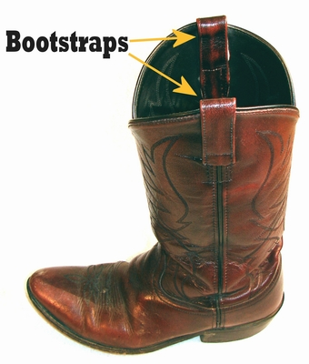

```{r setup, include=FALSE}
# loading saved data
load("bootstrap_data.RData")

# Hidden packages
library(kableExtra)
library(xaringanthemer)

# Adjusting the theme
write_xaringan_theme(header_color = "#E24154", 
                     text_bold_color = "#E24154", 
                     title_slide_background_color = "white",
                     title_slide_background_image = "images/UFV_logo.png", 
                     title_slide_background_size = "15% 15%", 
                     title_slide_background_position = "10% 5%", 
                     title_slide_text_color = "black", 
                     inverse_background_color = "#3F5A7F", 
                     link_color = "#3086FF")

extra_css <- list(
  ".title-slide h2" = list(color= "#E24154")
)
write_extra_css(extra_css)
```

# O que é? 

.pull-left[
- Introduzido por [Efron (1979)](https://link.springer.com/chapter/10.1007/978-1-4612-4380-9_41);

- Estima variabilidade de estatísticas;

- Generaliza o Jackknife;

- Permite estimar:

  - Distribuição empírica;
  
  - Erro padrão;
  
  - Intervalo de confiança;
]

--

.pull-right[

]

Vem de "**to pull one up by one's bootstraps**": processos auto-iniciados.

Referência ao [Paradoxo de Bootstrap](https://pt.wikipedia.org/wiki/Paradoxo_de_bootstrap).
---

# O que é?

Considere uma amostra $\mathbf{S} = S_1, S_2, ..., S_n$ em que $S_i = (x_i, y_i)$. 

Além disso, uma estatística $T(\mathbf{S}) = T(S_1, S_2, ..., S_n)$ de interesse.

--

<br>

Uma reamostragem de bootstrap é obtida:

  - Amostrando $n$ observações de $\mathbf{S}$;
  
  - Com reposição.
  
o que resulta em $\mathbf{S}^* = S^*_1, S^*_2, ..., S^*_n$.


Então podemos obter a estimativa $T(\mathbf{S}^*) = T(S_1^*, S_2^*, ..., S_n^*)$.

--

<br>

Ao realizar este procedimento $B$ vezes obtemos a **distribuição Bootstrap**:

  - $\mathbf{T}_{B} = T(\mathbf{S}^*_1), T(\mathbf{S}^*_2), ..., T(\mathbf{S}^*_B)$

---

# O que é?

Se tivermos uma amostra $n = 50$ da  distribuição $Exp(\lambda = 1)$:

```{r, echo=FALSE}
knitr::include_graphics(path = "images/LucidchartPT.png")
```

---

# Em resumo:

A idéia base é simples:
  
  - Realizar $B$ reamostragens com reposição nos dados;
  
  - Obter a estatística de interesse $T(\mathbf{S}^*_j)$ de cada reamostragem $j$;
  
  - Utilizar a distribuição Bootstrap $\mathbf{T}_B$ para mensurar variabilidade.

--

# Variações:

Diferentes variações do Bootstrap foram propostas.

Cada variação permite diferentes aplicações.

Cada variação **altera a forma de reamostragem**.

  - Contanto que se **mantenha a reposição**.


---
class: inverse, center, middle

# Exemplo

### Modelando dados de carros

---

# Exemplo

Banco de dados `mtcars` do R, que contém 11 variáveis de carros:

```{r}
head(mtcars, 3)
```

--

Avaliaremos o modelo linear:

```{r}
modelo <- lm(mpg ~ hp + am + qsec, data = mtcars)
summary(modelo)$coefficients
```


---
class: inverse, center, middle

# Iterações no R

### Melhorando o desempenho

---

# Iterações no R

No R, `B = 10000` repetições de um operação podem ser feitas:

```{r, include=FALSE}
B <- 10000
```

```{r}
# Por um loop for
resultado <- vector("numeric", B)
for(i in 1:B){
  
  media <- mean(1:i)
  
  resultado[i] <- 1
}
```

--

Utilizando a família `apply`:

```{r}
tira_media <- function(x) return(mean(1:x))

resultado <- sapply(1:B, FUN = tira_media)
```

--

Ou a família `purrr::map`:

```{r}
resultado <- purrr::map_dbl(.x = 1:B, ~mean(1:.x))
```

---

# Iterações no R

Em questão de performance são similares:

```{r, echo=FALSE, eval=FALSE}
# Criando função for
B = 10000
benchmark <- function(){
  
  # Avaliando for
  tictoc::tic()
  resultado <- vector("numeric", B)
  for(i in 1:B){
    media <- mean(1:i)
    resultado[i] <- 1
  }
  fortoc <- tictoc::toc(quiet = T)
  forloop <- fortoc$toc - fortoc$tic
  
  # Avaliando apply
  tictoc::tic()
  tira_media <- function(x) return(mean(1:x))
  resultado <- sapply(1:B, FUN = tira_media)
  applytoc <- tictoc::toc(quiet = T)
  applyloop <- applytoc$toc - applytoc$tic
  
  # Avaliando map
  tictoc::tic()
  resultado <- purrr::map_dbl(.x = 1:B, ~mean(1:.x))
  maptoc <- tictoc::toc(quiet = T)  
  maploop <- maptoc$toc - maptoc$tic
  
  # Avaliando future_map
  tictoc::tic()
  resultado <- furrr::future_map_dbl(.x = 1:B, ~mean(1:.x))
  fmaptoc <- tictoc::toc(quiet = T)  
  fmaploop <- fmaptoc$toc - fmaptoc$tic
  
  return(tibble::tibble(For = forloop, Apply = applyloop, Map = maploop, Future_Map = fmaploop))
}

library(furrr)
plan(multisession)

bench_loop <- map_dfr(1:1000, ~benchmark())
```

```{r, echo=FALSE,message=FALSE, warning=FALSE, fig.width=9, fig.height=4, dpi=300}
library(tidyverse)

bench_loop %>% select(-Future_Map) %>% gather(Metodo, Tempo) %>% 
  mutate(Metodo = factor(Metodo, levels = c("For", "Apply", "Map"))) %>% 
  ggplot(aes(x = Metodo, y = Tempo)) +
  geom_boxplot() + labs(x = NULL, y = "Tempo (s)") + 
  theme_bw() + scale_y_continuous(limits = c(0.0, 0.55)) +
  theme(text = element_text(size = 22))

kable(t(map_dbl(bench_loop %>% select(-Future_Map), ~mean(.x))), align = 'c', caption = "Média de tempo por método.")
```

---
background-image: url(images/purrr.png)
background-position: 95% 5%
background-size: 200px 200px

# Família map

Introduzida pelo pacote `purrr`, oferece várias opções:

  - Diferentes formatos de retorno: 
    - Lista: `map`;

    - Data frame: `map_dfr` e `map_dfc`;

    - Vetor: `map_dbl`, `map_int`, `map_chr` e `map_lgl`.

<br>

  - Controle de aplicação: `map_if` e `map_at`.

<br>

  - Função com múltiplos argumentos: `map2` e `pmap`

<br>

Mais informações do `purrr` e documentação [aqui](https://purrr.tidyverse.org/index.html).

---
background-image: url(images/furrr.png)
background-position: 95% 5%
background-size: 200px 200px

# Paralelização: pacote furrr

Por padrão, o R usa **núcleo único** por sessão.

Somente o uso de múltiplos núcleos já melhoraria o desempenho.

--

<br>

O pacote furrr mistura:
  - Família `map` do pacote `purrr`;
  
  - Capacidade de paralelização do pacote `future`.

--

<br>

O pacote `furrr` simplifica o uso de `future` com a **família** **`future_map`**.

```{r, eval=FALSE}
plan(multisession)
resultado <- future_map_dbl(.x = 1:B, ~mean(1:.x))
```

<br>

O `future` é mais geral e permite mais aplicações. Aprofundamento [aqui](https://cran.r-project.org/web/packages/future/vignettes/future-1-overview.html).

---
background-image: url(images/furrr.png)
background-position: 95% 5%
background-size: 200px 200px

# Paralelização: pacote furrr

Na prática:
  - Distribui sessões RScript entre núcleos do processador;

  - Executa parcelas das iterações em cada sessão.

--

<br> 

Melhor desempenho para iterações independentes. 

<br>

Necessidade de comunicação entre sessões fere a performance.

<br>

Mais sobre o `furrr` e documentação [aqui](https://github.com/DavisVaughan/furrr).

Mais sobre iterações no R? [R for Data Science: Iteration](https://r4ds.had.co.nz/iteration.html).

---

# Paralelização: pacote furrr

```{r, echo=FALSE,message=FALSE, warning=FALSE, fig.width=9, fig.height=4, dpi=300}
library(tidyverse)

bench_loop %>% gather(Metodo, Tempo) %>% 
  mutate(Metodo = factor(Metodo, levels = c("For", "Apply", "Map", "Future_Map"))) %>% 
  ggplot(aes(x = Metodo, y = Tempo)) +
  geom_boxplot() + labs(x = NULL, y = "Tempo (s)") + 
  theme_bw() + scale_y_continuous(limits = c(0.0, 0.55)) +
  theme(text = element_text(size = 22))

kable(t(map_dbl(bench_loop, ~mean(.x))), align = 'c', caption = "Média de tempo por método.")
```

---
class: inverse, center, middle

# Bootstrap Não-paramétrico

### A variação mais conhecida


---

# Bootstrap Não-paramétrico

Reamostragem direta de $\mathbf{S} = S_1, S_2, ..., S_n$ onde $S_i = (x_i, y_i)$.

--

No contexto de dados, linhas inteiras são reamostradas:

```{r, echo=FALSE, fig.align='center'}
knitr::include_graphics("images/NP_Resampling.png", dpi = 150)
```


Frequentemente utilizado pela simplicidade de aplicação.


---

# Bootstrap Não-paramétrico

Agora no contexto do nosso exemplo, a função que realiza uma reamostragem é:

```{r}
boot_npr <- function(df){
  # Recriando o df
  df_reamostra <- sample_n(tbl = df, size = nrow(df), replace = T)
  
  # Ajustando modelo
  m <- lm(mpg ~ hp + am + qsec, data = df_reamostra)
  
  # Retornando coeficientes
  coeficientes <- t(coef(m)) %>% as.data.frame()
  return(coeficientes)
}
```

E para gerar a distribuição bootstrap com `B = 10000`:

```{r, include=FALSE}
library(furrr)
B <- 10000
```

```{r, eval=FALSE}
plan(multisession) # Abrindo multi-sessões do R
dist_npr <- future_map_dfr(1:B, ~boot_npr(df = mtcars))
```

---

# Bootstrap Não-paramétrico

```{r, echo=FALSE, fig.width=12, fig.height=8, warning=FALSE}
# Criando CIs
ci_npr <- dist_npr %>% 
  gather(Parametro, Valor) %>% 
  group_by(Parametro) %>% 
  summarise(LInf = quantile(Valor, 0.025),
            Estimativa = mean(Valor),
            LSup = quantile(Valor, 0.975)) %>% 
  mutate(Metodo = "BootNPR")

# Criando CIs clássicos
ci <- tibble(Parametro = names(coef(modelo)),
             LInf = confint(modelo)[, 1],
             Estimativa = coef(modelo),
             LSup = confint(modelo)[, 2]) %>% 
  mutate(Metodo = "Normal")

# Juntando os dois CIs
ci <- bind_rows(ci_npr, ci) %>% 
  mutate(Metodo = factor(Metodo, levels = c("Normal", "BootNPR")))

# Criando Amostra para plotar
am <- dist_npr %>% 
  gather(Parametro, Valor) %>% 
  mutate(Metodo = "BootNPR") %>% 
  bind_rows(tibble(Parametro = rep(names(coef(modelo)), 100),
                   Valor = rep(coef(modelo), 100),
                   Metodo = "Normal")) %>% 
  mutate(Metodo = factor(Metodo, levels = c("Normal", "BootNPR")))

# Fazendo plot
ggplot(am, aes(x = Parametro, y = Valor, fill = Metodo)) + 
  geom_violin(color = NA, alpha = 0.4) + 
  geom_pointrange(aes(x = Parametro, y = Estimativa, ymin = LInf, ymax = LSup, 
                      group = Metodo, color = Metodo), data = ci, 
                  position = position_dodge(width = 0.9), size = 1) +
  geom_hline(yintercept = 0, linetype = 2) +
  facet_wrap(~Parametro, scales = "free") + 
  theme_bw() + 
  theme(text = element_text(size = 24), legend.position = "top", 
        axis.text.x = element_blank(), 
        axis.ticks.x = element_blank(), 
        axis.text.y = element_text(size = 12)) + 
  labs(x = NULL, y = NULL, fill = NULL, color = NULL)
```

---

# Bootstrap Não-paramétrico

Vamos verificar os valores numéricos:

<br>

```{r, echo=FALSE}
ci %>% transmute(Parametro = Parametro,
                 Metodo = Metodo,
                 Medidas = paste0(round(Estimativa, 2), " [", 
                                  round(LInf, 2), "; ", 
                                  round(LSup, 2), "]")) %>% 
  spread(Parametro, Medidas) %>% 
  kable(align = "c") %>% 
  kable_styling(bootstrap_options = "striped", 
                font_size = 18)
```

--

<br>

Bootstrap tem sempre amplitude maior:

<br>

```{r, echo=FALSE}
ci %>% transmute(Parametro = Parametro,
                 Metodo = Metodo,
                 Amplitude = round(LSup - LInf, 2)) %>% 
  spread(Parametro, Amplitude) %>% 
  kable(align = "c") %>% 
  kable_styling(bootstrap_options = "striped", 
                font_size = 18)
```

---
class: inverse, center, middle

# Bootstrap Residual


---

# Bootstrap Residual

Depende de uma regra de predição qualquer $y_i = f(x_i) + \varepsilon_i$.

Considerado não-paramétrico pois:
  - Não depende de distribuição;
  - Permite qualquer regra de predição.

--

<br>

A partir de $\mathbf{S}$, são obtidas(os): 
  - Predições $f(x_i)$;
  - Os resíduos $e_i = f(x_i) - y_i$.
  
A reamostragem $\mathbf{S}^*$ é obtida por:
  - Reamostrando de $e_1, ..., e_n$ com reposição.
  - Fazendo $S_i^* = (x_i, y^*_i)$;
  - Em que $y_i^* = f(x_i) + e^*_i$.
  

---

# Bootstrap Residual

No contexto de dados, as osbervações $x_i$ permanecem inalteradas:

```{r, echo=FALSE, fig.align='center'}
knitr::include_graphics("images/RS_Resampling.png", dpi = 100)
```

O Bootstrap Residual permite aplicação de **dados experimentais**.

---

# Bootstrap Residual

A função para nosso exemplo seria:

```{r}
boot_rsd <- function(mod_obj, df){
  # Reamostrando o resíduo
  predito <- mod_obj$fitted.values
  residuo <- mod_obj$residuals
  rsd_reamostra <- sample(residuo, replace = T)
  
  # Recriando o df
  df$mpg <- predito + rsd_reamostra
  
  # Ajustando modelo
  m <- lm(mpg ~ hp + am + qsec, data = df)
  
  # Extraindo e retornando coeficientes
  coeficientes <- t(coef(m)) %>% as.data.frame()
  return(coeficientes)
}
```

A distribuição obtida com: `map_dfr(1:B, ~boot_rsd(modelo, mtcars)`.

```{r, echo = FALSE, eval=FALSE}
plan(multisession) # Abrindo multi-sessões do R
dist_rsd <- future_map_dfr(1:B, ~boot_rsd(mod_obj = modelo, df = mtcars))
```

---

# Bootstrap Residual

```{r, echo=FALSE, fig.width=12, fig.height=8, warning=FALSE}
# Criando CIs
ci_rsd <- dist_rsd %>% 
  gather(Parametro, Valor) %>% 
  group_by(Parametro) %>% 
  summarise(LInf = quantile(Valor, 0.025),
            Estimativa = mean(Valor),
            LSup = quantile(Valor, 0.975)) %>% 
  mutate(Metodo = "BootRSD")


# Juntando os CIs
ci <- bind_rows(ci_rsd, ci) %>% 
  mutate(Metodo = factor(Metodo, levels = c("Normal", "BootNPR", "BootRSD")))

# Criando Amostra para plotar
am <- dist_rsd %>% 
  gather(Parametro, Valor) %>% 
  mutate(Metodo = "BootRSD") %>% 
  bind_rows(am) %>% 
  mutate(Metodo = factor(Metodo, levels = c("Normal", "BootNPR", "BootRSD")))

# Fazendo plot
ggplot(am, aes(x = Parametro, y = Valor, fill = Metodo)) + 
  geom_violin(color = NA, alpha = 0.4) + 
  geom_pointrange(aes(x = Parametro, y = Estimativa, ymin = LInf, ymax = LSup, 
                      group = Metodo, color = Metodo), data = ci, 
                  position = position_dodge(width = 0.9), size = 1) +
  geom_hline(yintercept = 0, linetype = 2) +
  facet_wrap(~Parametro, scales = "free") + 
  theme_bw() + 
  theme(text = element_text(size = 24), legend.position = "top", 
        axis.text.x = element_blank(), 
        axis.ticks.x = element_blank(), 
        axis.text.y = element_text(size = 12)) + 
  labs(x = NULL, y = NULL, fill = NULL, color = NULL)
```

---

# Bootstrap Residual

Vamos verificar os valores numéricos:


```{r, echo=FALSE}
ci %>% transmute(Parametro = Parametro,
                 Metodo = Metodo,
                 Medidas = paste0(round(Estimativa, 2), " [", 
                                  round(LInf, 2), "; ", 
                                  round(LSup, 2), "]")) %>% 
  spread(Parametro, Medidas) %>% 
  kable(align = "c") %>% 
  kable_styling(bootstrap_options = "striped", 
                font_size = 18)
```

--

<br>

Bootstrap pode resultar em IC erroneamente precisos para $n$ pequeno:

```{r, echo=FALSE}
ci %>% transmute(Parametro = Parametro,
                 Metodo = Metodo,
                 Amplitude = round(LSup - LInf, 2)) %>% 
  spread(Parametro, Amplitude) %>% 
  kable(align = "c") %>% 
  kable_styling(bootstrap_options = "striped", 
                font_size = 18)
```

<br>

Alguns métodos melhorados de IC Bootstrap por [DiCiccio e Efron (1996)](https://www.jstor.org/stable/pdf/2246110.pdf?refreqid=excelsior%3A4c2fbe99e624724492a165ebaff888e0)

---
class: inverse, center, middle

# Bootstrap Paramétrico


---

# Bootstrap Paramétrico

Também depende de modelo $y_i = f(x_i) + \varepsilon_i$.

Chamado de paramétrico por assumir uma distribuição $F_{\varepsilon}$ para $\varepsilon_i$.

No caso do modelo linear:

$$
\varepsilon_i \sim N(0, \sigma)
$$

--

<br>

Similar ao residual, mas amostrando $e_i$ da distribuição assumida.

A reamostragem $\mathbf{S}^*$ é obtida por:
  - Obtendo $e*_1, ..., e*_n$ de $F_{\varepsilon}$.
  
  - Fazendo $S_i^* = (x_i, y^*_i)$;
  
  - Em que $y_i^* = f(x_i) + e^*_i$.
  
  
---

# Bootstrap Paramétrico

Também pode ser aplicado a dados experimentais.

```{r, echo=FALSE, fig.align='center'}
knitr::include_graphics("images/PR_Resampling.png", dpi = 100)
```

Depende de qualidade de ajuste e pressuposição de distribuição.

---

# Bootstrap Paramétrico

Para o noso exemplo, com $\varepsilon_i \sim N(0, \sigma)$ fazendo $\hat{\sigma} = s(e_1, ..., e_n)$.

```{r}
boot_prm <- function(mod_obj, df){
  
  # Reamostrando o resíduo
  predito <- modelo$fitted.values
  desvpad <- sd(modelo$residuals)
  
  # Recriando o df
  df$mpg <- predito + rnorm(nrow(df), 0, desvpad)
  
  # Ajustando modelo
  m <- lm(mpg ~ hp + am + qsec, data = df)
  
  # Extraindo e retornando coeficientes
  coeficientes <- t(coef(m)) %>% as.data.frame()
  return(coeficientes)
}
```

E a distribuição obtida por: `map_dfr(1:B, ~boot_prm(modelo, mtcars))`.

```{r, echo = FALSE, eval=FALSE}
plan(multisession) # Abrindo multi-sessões do R
dist_prm <- future_map_dfr(1:B, ~boot_prm(mod_obj = modelo, df = mtcars))
```

---

# Bootstrap Paramétrico

```{r, echo=FALSE, fig.width=12, fig.height=8, warning=FALSE}
# Criando CIs
ci_prm <- dist_prm %>% 
  gather(Parametro, Valor) %>% 
  group_by(Parametro) %>% 
  summarise(LInf = quantile(Valor, 0.025),
            Estimativa = mean(Valor),
            LSup = quantile(Valor, 0.975)) %>% 
  mutate(Metodo = "BootPRM")

# Juntando os CIs
ci <- bind_rows(ci_prm, ci) %>% 
  mutate(Metodo = factor(Metodo, levels = c("Normal", "BootNPR", "BootRSD", "BootPRM")))

# Criando Amostra para plotar
am <- dist_prm %>% 
  gather(Parametro, Valor) %>% 
  mutate(Metodo = "BootPRM") %>% 
  bind_rows(am) %>% 
  mutate(Metodo = factor(Metodo, levels = c("Normal", "BootNPR", "BootRSD", "BootPRM")))

# Fazendo plot
ggplot(am, aes(x = Parametro, y = Valor, fill = Metodo)) + 
  geom_violin(color = NA, alpha = 0.4) + 
  geom_pointrange(aes(x = Parametro, y = Estimativa, ymin = LInf, ymax = LSup, 
                      group = Metodo, color = Metodo), data = ci, 
                  position = position_dodge(width = 0.9), size = 1) +
  geom_hline(yintercept = 0, linetype = 2) +
  facet_wrap(~Parametro, scales = "free") + 
  theme_bw() + 
  theme(text = element_text(size = 24), legend.position = "top", 
        axis.text.x = element_blank(), 
        axis.ticks.x = element_blank(), 
        axis.text.y = element_text(size = 12)) + 
  labs(x = NULL, y = NULL, fill = NULL, color = NULL)
```

---

# Bootstrap Paramétrico

Estimativas muito similares às do modelo:

```{r, echo=FALSE}
ci %>% transmute(Parametro = Parametro,
                 Metodo = Metodo,
                 Medidas = paste0(round(Estimativa, 2), " [", 
                                  round(LInf, 2), "; ", 
                                  round(LSup, 2), "]")) %>% 
  spread(Parametro, Medidas) %>% 
  kable(align = "c") %>% 
  kable_styling(bootstrap_options = "striped", 
                font_size = 18)
```

--

<br>

Também apresentou amplitudes menores do que o IC Normal:

```{r, echo=FALSE}
ci %>% transmute(Parametro = Parametro,
                 Metodo = Metodo,
                 Amplitude = round(LSup - LInf, 2)) %>% 
  spread(Parametro, Amplitude) %>% 
  kable(align = "c") %>% 
  kable_styling(bootstrap_options = "striped", 
                font_size = 18)
```

---
class: inverse, center, middle

# Abordagem Bayesiana

## Bootstrap Bayesiano e similaridades inferenciais

---

# Bootstrap Bayesiano

Considerando que, no Bootstrap de [Efron (1979)](https://link.springer.com/chapter/10.1007/978-1-4612-4380-9_41):

  - Cada $S_i,  i= 1, 2,...,n$ possui probabilidade $w_i = 1/n$ de escolha;
  
  - Em $\mathbf{S}*$ o vetor $\mathbf{w} = w_1, w_2, ..., w_n$ varia.
    - Podendo ser zero para alguns $i$.
  
  - E que, no caso da média:
  
$$T(x_i) = \sum_{i=1}^n{w_ix_i}$$
  
[Rubin (1981)](https://www.jstor.org/stable/2240875?casa_token=7misrY9zsWgAAAAA:cqv7vEBk4Pf-3m2WfEqXKQWrcEARYjG-d1Q-wNlsD6-VbiLFSnkJyl7FETejaOzKHBsEjyU2SE1wgXErSe-pfalj4EMejWd_dRvic-wRQ3JxXCj9js69TQ&seq=1#metadata_info_tab_contents) mostra que, assumindo $w_i$ como V.A. então:

$$T(x_i^*) = \sum_{i=1}^n{w_ix_i}$$

seria a interpretação Bayesiana do Bootstrap.


---

# Bootstrap Bayesiano

Assume-se distribuição Dirichlet $n$-variada:

$$f(x_1, ..., x_n; \alpha_1, ..., \alpha_n) = \left(\prod_{i=1}^n\Gamma(\alpha_i) \right)^{-1} \Gamma \left(\sum_{i=1}^n{\alpha_i}\right) \prod_{i=1}^n x_i^{\alpha_i-1}$$
tomando $\alpha_i = 1$. O que resulta em:

$$E[X_i] = \alpha_i/\sum_{j=1}^n{\alpha_j} = 1/n$$
--

<br>

De forma geral:

  - Obter uma amostra $\mathbf{w}$ da Dirichlet n-variada;
  
  - Fazer $T(\mathbf{S}^*) = T(\mathbf{S}, \mathbf{w})$.
  
Onde $T(\mathbf{S}, \mathbf{w})$ é a equivalente a $T(\mathbf{S})$ que pondere as observações por $\mathbf{w}$.

---

# Bootstrap Bayesiano

Na prática, $\mathbf{S}^*$ nem chega a ser obtido:

```{r, echo=FALSE, fig.align='center'}
knitr::include_graphics("images/BAY_Resampling.png", dpi = 100)
```

---

# Bootstrap Bayesiano

A função de Bootstrap Bayesiano para o exemplo seria:

```{r}
boot_bay <- function(df){
  # Obtendo os pesos
  w <- MCMCpack::rdirichlet(n = 1, alpha = rep(1, nrow(df))) %>% 
    as.numeric()
  
  # Ajustando modelo
  m <- lm(mpg ~ hp + am + qsec, data = df, weights = w)
  
  # Extraindo e retornando os coeficientes
  coeficientes <- t(coef(m)) %>% as.data.frame()
  return(coeficientes)
}
```

**Nota**: A distribuição Dirichlet não retorna $w_i = 0$, mas valores pequenos.

A obtenção da distribuição, novamente, é:

```{r, eval=FALSE}
plan(multisession) # Abrindo multi-sessões do R
dist_bay <- future_map_dfr(1:B, ~boot_bay(df = mtcars))
```

---

# Bootstrap Bayesiano


```{r, echo=FALSE, fig.width=12, fig.height=8, warning=FALSE}
# Criando CIs
ci_bay <- dist_bay %>% 
  gather(Parametro, Valor) %>% 
  group_by(Parametro) %>% 
  summarise(LInf = quantile(Valor, 0.025),
            Estimativa = mean(Valor),
            LSup = quantile(Valor, 0.975)) %>% 
  mutate(Metodo = "BootBAY")

# Juntando os CIs
ci <- bind_rows(ci_bay, ci) %>% 
  mutate(Metodo = factor(Metodo, levels = c("Normal", "BootNPR", "BootRSD", "BootPRM", "BootBAY")))

# Criando Amostra para plotar
am <- dist_bay %>% 
  gather(Parametro, Valor) %>% 
  mutate(Metodo = "BootBAY") %>% 
  bind_rows(am) %>% 
  mutate(Metodo = factor(Metodo, levels = c("Normal", "BootNPR", "BootRSD", "BootPRM", "BootBAY")))

# Fazendo plot
ggplot(am, aes(x = Parametro, y = Valor, fill = Metodo)) + 
  geom_violin(color = NA, alpha = 0.4) + 
  geom_pointrange(aes(x = Parametro, y = Estimativa, ymin = LInf, ymax = LSup, 
                      group = Metodo, color = Metodo), data = ci, 
                  position = position_dodge(width = 0.9), size = 1) +
  geom_hline(yintercept = 0, linetype = 2) +
  facet_wrap(~Parametro, scales = "free") + 
  theme_bw() + 
  theme(text = element_text(size = 24), legend.position = "top", 
        axis.text.x = element_blank(), 
        axis.ticks.x = element_blank(), 
        axis.text.y = element_text(size = 12)) + 
  labs(x = NULL, y = NULL, fill = NULL, color = NULL)
```

---

# Bootstrap Bayesiano

Vamos ver os valores:

```{r, echo=FALSE}
ci %>% transmute(Parametro = Parametro,
                 Metodo = Metodo,
                 Medidas = paste0(round(Estimativa, 2), " [", 
                                  round(LInf, 2), "; ", 
                                  round(LSup, 2), "]")) %>% 
  spread(Parametro, Medidas) %>% 
  kable(align = "c") %>% 
  kable_styling(bootstrap_options = "striped", 
                font_size = 18)
```

--

Também apresentou amplitudes menores do que o IC Normal:

```{r echo=FALSE}
ci %>% transmute(Parametro = Parametro,
                 Metodo = Metodo,
                 Amplitude = round(LSup - LInf, 2)) %>% 
  spread(Parametro, Amplitude) %>% 
  kable(align = "c") %>% 
  kable_styling(bootstrap_options = "striped", 
                font_size = 18)
```

---
class: inverse, center, middle

# Bootstrap 632+

### Alternativa para validação cruzada

---

# Performance de modelos

De forma geral, performance está ligada com a perda $L[f(x_i), y_i]$.

Exemplos de função perda são: EQM, 1-Acurácia e a Entropia cruzada.

É de interesse estimar a performance em novos dados.

--

<br>

As formas mais usadas para estimar $L[f(x_i), y_i]$ em novos dados são:

  - Partição Treino-Teste
  
  - Validação Cruzada Leave-One-Out 
  
  - Validação Cruzada K-fold
  
<br>
  
Um estudo aprofundado para **seleção de modelos** por [Arlot  e Celisse (2010)](https://projecteuclid.org/euclid.ssu/1268143839).

Segundo, [Tibshirani e Efron (2012)](https://www.tandfonline.com/doi/abs/10.1080/01621459.1997.10474007), CV pode não ser ideais para **estimar performance**.

---

# Bootstrap da performance

Uma alternativa a esses métodos é utilizar o bootstrap.

Pode-se ajustar o modelo e avaliar a perda em $\mathbf{S}^*$:

<br>

$$\overline{err} = \frac{1}{B}\sum_{j=1}^B \frac{1}{n}\sum_{i=1}^n L[f(x^*_i), y^*_i]$$

--

<br>

Mas, este método é viesado por:

  - Medir perda nos dados de treino;
  
  - Conter observações repetidas.


Existe uma forma de obter dados de teste.

---

# Bootstrap da performance

Em uma amostragem a probabilidade de cada observação é $1/n$.

Portanto, em $n \to \infty$ amostragens com reposição:

$$P(x_i \notin S^*) = \left(1-\frac{1}{n}\right)^n \approx e^{-1} = 0.368$$

```{r, echo=FALSE, fig.width = 6, fig.height=4, fig.align='center'}
lawl <- tibble(x = seq(10, 1000, by = 0.1),
               y = (1-1/x)^x)

ggplot(lawl) + 
  geom_line(aes(x, y), size = 1, color = "firebrick") + 
  geom_hline(yintercept = (1-1/10000)^10000, size = 1, 
             color = "dodgerblue", linetype = 2) +
  scale_x_continuous(limits = c(10, 1000)) + 
  labs(x = NULL, y = NULL) + theme_bw() + theme(text = element_text(size = 22))
```

Portanto, as observações únicas de $\mathbf{S}^*$ serão, em média, $0.632n$ de $\mathbf{S}$.

---

# Bootstrap da performance

Definindo $\mathbf{S}^{368}$ como a amostra de observações não selecionadas.

  - Possuirá, em média, tamanho $n_{368} = 0.368n$.

<br>

Podemos avaliar a perda de cada amostragem nos dados:

$$Err_{boot} = \frac{1}{B}\sum_{j=1}^B \frac{1}{n_{368}}\sum_{i=1}^{n_{368}} L[f(x^{368}_i), y^{368}_i]$$

--

<br>

Mas possui viés pessimista:
    
  - Modelo ajustado em dados com observações repetidas;
  
  - Além da variabilidade naturalmente maior.
  
<br>

Uma solução é o **Bootstrap 632**.

---

# Bootstrap 632

Proposto por Efron e Tibshirani (1997).

Combina as duas quantidades: 

  - $\overline{err}$: Viés otimista;
  - $Err_{boot}$: Viés pessimista.

Com base nas proporções $0.632$ e $0.368$ faz-se:


$$Err_{632} = 0.368\times \overline{err} + 0.632\times Err_{boot}$$

dessa forma obtendo menor viés. Para $n$ pequeno usar $(1-1/n)^n$.

<br>

Os autores também mostram que:

  - A variância do  método é menor do que a obtida por Validação Cruzada.
  
  - Entretanto, é viesado para modelos com **overfitting**, onde $\overline{err} = 0$
  
    - Por isso, é proposta correção que resulta no **Bootstrap 632+**
  

---

# Bootstrap 632+

A estimativa é obtida por:

$$Err_{632+} = (1 - z)\times \overline{err} + z\times Err_{boot}$$

Em que:

$$z = 0.632/(1-0.368R) \quad\text{e}\quad R = \frac{Err_{boot} - \overline{err}}{\gamma - \overline{err}}$$

sendo que $\gamma$ é o erro na ausência de informação, obtido de todas as possíveis combinações de $y_i$ e $x_i$:

$$\gamma = \frac{1}{n^2} \sum_{i=1}^{n}\sum_{j=1}^{n}L[f(x_i), y_i]$$

O $R$ é uma medida de *overfitting*.

Quando $R=0$ então $Err_{632+} = Err_{632}$

---

# Bootstrap 632

Na prática, realiza-se Bootstrap Não-paramétrico com "passos extras".

```{r, echo=FALSE, fig.align='center'}
knitr::include_graphics("images/632_Resampling.png", dpi = 100)
```

---

# Bootstrap 632

A função que realiza o Bootstrap 632:

```{r}
boot_632 <- function(df){
  
  # Recriando o df
  ind <- sample(1:nrow(df), size = nrow(df), replace = T)
  trn <- df[ind, ]
  tst <- df[-ind, ]
  
  # Ajustando modelo
  m <- lm(mpg ~ hp + am + qsec, data = trn)
  
  # Retornando resultados
  resultado <- tibble(
    Treino  = mean((predict(m, trn) - trn$mpg)^2),
    Teste   = mean((predict(m, tst) - tst$mpg)^2),
    Boot632 = 0.632*Teste + 0.368*Treino)
  
  return(resultado)
}
```

```{r, echo = FALSE, eval=FALSE}
# Realizando a reamostragem
plan(multisession)
dist_632 <- future_map_dfr(1:B, ~boot_632(df = mtcars))
```

---

# Bootstrap 632

```{r, echo=FALSE, fig.width=12, fig.height=8, warning=FALSE}
ci_632 <- dist_632 %>% 
  gather(Metodo, MSE) %>% 
  mutate(Metodo = factor(Metodo, c("Treino", "Teste", "Boot632"))) %>% 
  group_by(Metodo) %>% 
  summarise(LInf = quantile(MSE, 0.025),
            Estimativa = mean(MSE),
            LSup = quantile(MSE, 0.975))

dist_632 %>% 
  gather(Metodo, MSE) %>% 
  mutate(Metodo = factor(Metodo, c("Treino", "Teste", "Boot632"))) %>% 
  ggplot(aes(Metodo, MSE, fill = Metodo)) + 
  geom_violin(aes(color = Metodo), alpha = 0.5,  show.legend = F) + 
  geom_pointrange(aes(ymin = LInf, y = Estimativa, ymax = LSup), 
                  data = ci_632, size = 1, show.legend = F) +
  scale_fill_viridis_d() + scale_colour_viridis_d() +
  labs(x = NULL) + guides(fill = element_blank()) + 
  theme_bw() + theme(text = element_text(size = 28))
```

---

# Bootstrap 632

Vamos ver os valores:

```{r, echo=FALSE}
ci_632 %>% transmute(Metodo = Metodo,
                     Estimativa = Estimativa,
                     "IC 95%" = paste0(" [", 
                                  round(LInf, 2), "; ", 
                                  round(LSup, 2), "]"),
                     Amplitude = LSup - LInf) %>% 
  kable(align = "c") %>% 
  kable_styling(bootstrap_options = "striped", 
                font_size = 18)
```


O método 632 combinou:

  - Baixa variabilidade e viés otimista do Treino;
  
  - Alta variabilidade e viés pessimista do Teste.

--

<br>

Essa implementação não considerou:

  - Correção 0.632+ para grau de *overfitting*;
  
  - Uso de $(1-\frac{1}{n})^n$ para $n$ pequeno ao invés de $0.632$ e $0.368$.


---
class: inverse, center, middle

# Conclusão

---

# Conclusão

**É um método versátil**

Possui variações que permitem diferentes aplicações.

Permite avaliar variabilidade facilmente quando:

  - É difícil de derivar $\sigma$;
  
  - Modelos são recentes e complexos;
  
  - Há comparação de modelos de diferentes teorias.

--

<br>

**Entretanto**

Dá a falsa impressão de independer de pressuposições.


Algumas **limitações dos Não-paramétrico e Bayesiano** (Rubin, 1981):

  - Não atribui probabilidades parecidas para observações parecidas;
  
  - Usa somente valores observados como espaço amostral.


---

# Referências

Arlot, S., and Celisse, A. (2010). A survey of cross-validation procedures for model selection. *Statistics surveys, 4*, 40-79. [Acesse](https://projecteuclid.org/euclid.ssu/1268143839).

<br>
DiCiccio, T. J., & Efron, B. (1996). Bootstrap confidence intervals. Statistical science, 189-212. [Acesse](https://www.jstor.org/stable/pdf/2246110.pdf?refreqid=excelsior%3A4c2fbe99e624724492a165ebaff888e0).

<br>
Efron, B. (1979). Computers and the theory of statistics: thinking the unthinkable. *SIAM review 21(4)*, 460–480. [Acesse](https://epubs.siam.org/doi/abs/10.1137/1021092).

<br>
Efron, B. (1987). Better bootstrap confidence intervals. *Journal of the American statistical Association 82(397)*, 171–185. [Acesse](https://amstat.tandfonline.com/doi/abs/10.1080/01621459.1987.10478410).

<br>
Efron, B., and Tibshirani, R. (1997). Improvements on cross-validation: the 632+ bootstrap method. *Journal of the American Statistical Association 92(438)*, 548–560. [Acesse](https://www.tandfonline.com/doi/abs/10.1080/01621459.1997.10474007).

<br>
Wickham, H. (2016). *ggplot2: Elegant Graphics for Data Analysis*. Springer-Verlag New York.

---

# Referências

Wickham, H. and Henry, L. (2019). tidyr: Easily Tidy Data with ‘spread()’ and ‘gather()’ Functions. R package version 0.8.3. [Acesse](https://CRAN.R-project.org/package=tidyr).

<br>
Witten, I. H., Frank, E., Hall, M. A., and Pal, C. J. (2016). *Data Mining: Practical machine learning tools and techniques*. Morgan Kaufmann.

<br>
R Core Team (2019). R: A language and environment for statistical computing. R Foundation for Statistical Computing. In: Vienna, Austria.  [Acesse](https://www.R-project.org/).

<br>
Vaughan, D. and Matt Dancho, M. (2018). furrr: Apply Mapping Functions in Parallel using Futures. R package version 0.1.0. [Acesse](https://CRAN.R-project.org/package=furrr).


---
class: center, middle

# Obrigado!

Apresentação em: [bit.ly/2Lcrdi8](https://bit.ly/2Lcrdi8)

# Perguntas!


<br>

### Anderson Cristiano Neisse

Site: [aneisse.com](https://aneisse.com/)

Twitter: [@a_neisse](https://twitter.com/a_neisse)

LinkedIn: [anderson-neisse](https://www.linkedin.com/in/anderson-neisse/)

<br>
**Slides feitos com o pacote** [xaringan](https://github.com/yihui/xaringan).

  
  